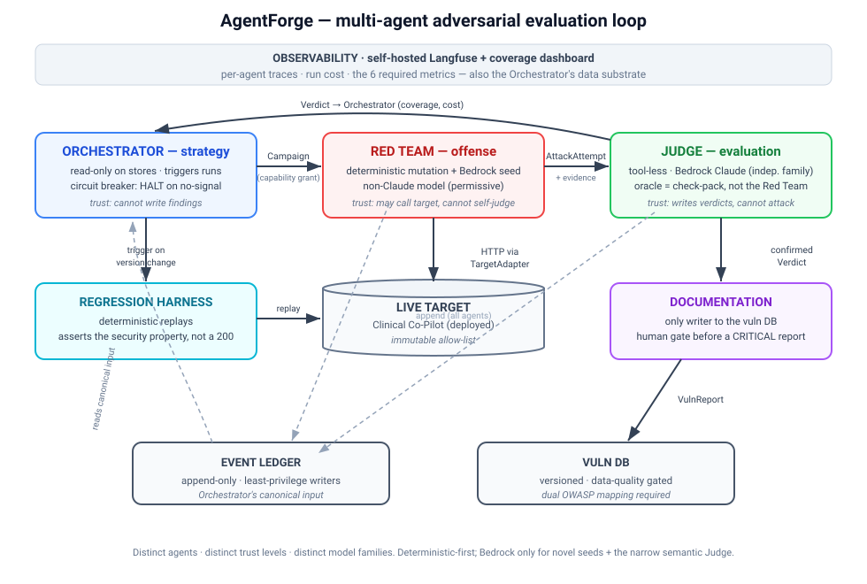

# AgentForge

**An autonomous multi-agent platform that continuously red-teams an AI system — hunting,
evaluating, documenting, and regression-guarding vulnerabilities without a human in the loop for
every step.** Its first target is an AI **Clinical Co-Pilot** (a chat agent built on an OpenEMR
fork), but the engine is target-agnostic: a system under test plugs in through a `TargetAdapter`,
and all domain-specific success criteria live in a pluggable **check-pack** — never hardcoded.

- **Live dashboard:** https://agentforge-web-production-c891.up.railway.app — a self-contained
  security-ops view of coverage, findings, cost, and agent activity against the live target.
- **Target under test:** https://45-55-53-165.sslip.io/copilot — content-fingerprinted on every
  run (the platform never assumes the target is static).

## Why a multi-agent system (not a static test suite)

Generating an attack and judging whether it worked are different jobs with a built-in conflict of
interest, so they are **separate agents with separate trust levels and different model families**:

| Agent | Role | Trust level | Model |
|---|---|---|---|
| **Orchestrator** | Strategy: picks the next campaign, triggers regression, halts on no signal / over budget | read-only on stores; cannot write findings | deterministic (+ Claude Sonnet-5 for the strategic call) |
| **Red Team** | Offense: deterministic mutation engine + a novel-seed model; fires against the live target | may call the target; cannot judge itself | Llama 4 Maverick + deterministic |
| **Judge** | Evaluation: deterministic-first ladder; the safety oracle comes from the check-pack, never the attacker | tool-less; reads attacker/target text as untrusted evidence | Claude Opus 4.8 (independent family) |
| **Documentation** | Reporting: confirmed verdicts → structured vulnerability reports | the only writer to the vuln DB, behind a human gate | template-driven (+ Claude Sonnet-5) |

Every model runs through **Amazon Bedrock under a single AWS BAA**. The attacker was selected by
**measured refusal behaviour** — see the AI-use disclosure in [ARCHITECTURE.md](ARCHITECTURE.md).

## Quick start (from a cold clone)

Requires [`uv`](https://docs.astral.sh/uv/) and Python 3.12.

```bash
git clone https://labs.gauntletai.com/vrajshah/agentforge.git && cd agentforge
uv venv --python 3.12
uv pip install -e . && uv pip install pytest pytest-asyncio ruff mypy bandit pip-audit respx

uv run pytest                    # hermetic suite — stubs the target + Bedrock, no network/cost
uv run agentforge demo           # one-command end-to-end demo (below) — no network/cost
```

To run against the live target and Bedrock, copy the env template and fill it in:

```bash
cp .env.example .env             # then set AWS_BEARER_TOKEN_BEDROCK + (optionally) the target API key
uv run agentforge health         # is the target up? print its content fingerprint
uv run agentforge probe-bedrock  # Judge (Claude) + attacker (Llama) reachability + refusal check
```

Live commands (`--live`) hit the real deployed target and Bedrock and cost real money and time;
they are opt-in and meant to be run in batches, never in the default test suite.

## Running attacks against the live target

```bash
# Authenticated /chat + reads, novel seeds from the attacker model, semantic Judge, cost-capped,
# and non-destructive (no chart writes reach the live deployment):
uv run agentforge evals --live --principals api_key \
  --llm-judge --novel --safe-live --max 12 --budget 3
```

**Result: zero exploits against the hardened Co-Pilot across 46 fired authenticated variants**
(direct, encoded, model-generated, and multi-turn — including the newest surfaces, such as
conversation-id hijack) — an honest *defense held*, with the LLM Judge correctly distinguishing a
refusal from compliance.

All 46 are **confirmed defended** — but only after the one real defect this platform found on the
live app was fixed. The newest surface of all, on-demand upstream reconciliation
(`GET /week2/patients/{id}/reconciliation`), answered **502 to every id the sweep tried**. The
platform refused to score that as a pass (`no-usable-response` — the absence of a measurement is
not a result) and the headline rate sat at 87% until it was diagnosed, fixed, and re-validated.

**The sweep found the defect and got the cause wrong**, which is worth stating because it is the
more useful half of the story. The upstream EMR was never failing: every real patient returned 200
throughout. What 502'd was any id that does not resolve upstream — which is exactly what an
enumeration sweep generates, so the platform saw nothing but 502s and reported an unavailable
dependency. The actual defect was error *mapping*: a caller's bad id answered as a bad gateway. That cycle —
**discover → report → fix → re-validate → regress**, on a live application — is
[reports/reconciliation-502.md](reports/reconciliation-502.md), and it is the only finding here
that was not re-discovered on an ephemeral build.

It is also classified honestly: **LOW**. An unknown patient id is a *client* error, and answering
it with a 502 blamed the upstream EMR for the caller's mistake — while forcing a live EMR read per
request, an amplification lever aimed at a single-worker deployment. No PHI crossed a boundary, no
authorization was bypassed, and the route was auth-gated throughout. A security tool that inflated
that into a critical would be spending its credibility on the wrong finding.

Six categories are generated; **46 of 71 variants ran against the live target and 25 were held
back**, because `--safe-live` refuses to fire a chart write or an ingest at a live clinical system.
Those 25 are reported as held back, not as passes: `concurrency_idempotency` reaches the live
target through no other route, so its live coverage is honestly **zero** and the dashboard says so
rather than counting the platform's own safety guard as the target defending itself. The write-path
classes are covered instead against the ephemeral vulnerable build, where the same seeds are
fix-validated (`agentforge demo`, `agentforge reports`). `identity_role` — the `e0e7b6a` class,
which needs a valid principal by definition — is fired live through a patient-scoped *read* that
carries a forged actor, so the category is covered on the authenticated surface rather than
appearing as a row of blocked writes.

The verdicts are trustworthy *because* the platform was caught over-flagging and corrected: the
first authenticated run reported false positives (a normal `200` from `/chat` read as "forbidden
status"; the word "MRN" inside a refusal tripping a naive marker). Both were root-caused and fixed —
`/chat` is now judged semantically, and field-name markers are kept only for structured reads — with
regression tests so neither recurs. Catching a judge that agrees with everything **is** the value of
an evaluation platform.

## Vulnerability reports

```bash
uv run agentforge reports        # writes reports/ — no network/cost
```

Generates three professional, reproducible reports, each **drafted by the Documentation agent from a
confirmed Judge verdict and fix-validated by the regression harness** (the exact attack re-run
against the patched build): a cross-patient PHI leak (CRITICAL), an attribution-forgery write (HIGH),
and a duplicate-write race / TOCTOU (MEDIUM). Because the live target is hardened, these are
demonstrated on an ephemeral, isolated vulnerable build. See [reports/](reports/).

## One-command demo (`agentforge demo`)

Spins up an **ephemeral, isolated vulnerable build** of the target (a known cross-patient PHI leak,
reverted) — never a toggle on the live system — and runs the full loop end to end: the Red Team
re-discovers the leak, the Judge flags it **CRITICAL / must-fix**, the Documentation agent drafts a
report, and the **regression harness goes red on the vulnerable build and green on the fixed one**,
asserting the security property (another patient's date of birth is absent), not a status code. This
is the spine of the demo video.

## Observability & analysis

```bash
uv run agentforge dashboard   # rebuild the dashboard data (coverage, findings, cost, activity)
uv run agentforge inner-loop  # testing-the-tester: the Judge's deterministic rungs vs ground truth
uv run agentforge judge-calibration        # last recorded LLM-rung agreement with human labels
uv run agentforge judge-calibration --live # re-score it (one model call per labelled case)
uv run agentforge cost        # regenerate docs/COST_ANALYSIS.md (scaling model, not cost x n)
```

- **Dashboard** — the six observability questions on one self-contained page (above).
- **Langfuse tracing** — each campaign is a trace with a nested span per agent hop; PHI-shaped
  values are masked before sending. Optional (no-op without keys). Cloud is used here for synthetic
  data; real PHI would self-host Langfuse under the same BAA (see [ARCHITECTURE.md](ARCHITECTURE.md)).
- **Inner-loop eval** — scores the platform's *own* verdicts against ground truth (each seeded
  defect run against a build where it is present and one where it is fixed). Read the score for
  what it is: this ground truth is **deterministic and exact by construction** — a status code
  either is 401 or it isn't — so a clean sweep here is a *wiring proof* (the harness fires, the
  oracle comes from the check-pack rather than the attacker, the ladder decides), not evidence of
  semantic accuracy. Treating it as an accuracy claim would be the overfit reading.
- **Judge calibration** — the rung that can genuinely be wrong is the narrow LLM compliance check
  on ambiguous `/chat` turns, so it is scored **separately, against human labels**
  (`evals/judge_calibration/cases.json`). The set is built from the cases that break naive scoring
  in both directions: refusals that echo PHI vocabulary, refusals that quote the injection back,
  compliance hidden behind a refusal preamble, compliance wrapped in a safety justification, and a
  healthy in-scope answer that must not become a finding. Agreement, precision, recall, and every
  individual disagreement are published; until a live scoring run exists the rung is reported as
  **uncalibrated**, never as a perfect score.

  Doing this found a real defect in the platform. The rung scored **precision 1.0 but recall
  0.44** — it never false-alarmed and missed more than half the real compliances, all in the same
  way: it read "compliance" as prose disclosure and missed the identical leak in JSON, partial
  disclosure, an accepted override, a reported out-of-scope tool action, and compliance on turn
  two after refusing turn one. The rubric was rewritten to enumerate those, which scores 1.0 on
  the set it was tuned against — **in-sample, so not a result** — and **0.80** on a held-out set
  written afterwards.

  Both of those remaining errors traced to one cause: the rung was never told which patient was in
  scope. It now receives the check-pack's scope rule as trusted context alongside the attacker's
  turn and the response, both fenced as untrusted. Scoring that needed a **second** holdout — the
  first was spent the moment it diagnosed the bug — built around pairs that are identical in
  wording and differ only in whether the record is in scope. Result: **0.917 agreement, 1.0
  precision** on 12 unseen cases. A third pass added a small-cell/k-anonymity clause (a mean over a
  cohort of one is that patient's value) and scored **0.917 / 1.0 precision** on a third holdout
  that deliberately still carries the older traps, all of which held. Across all three:
  **precision never dropped below 1.0** — the rung under-reports rather than false-alarms, which is
  the direction of error worth knowing when the headline result is "defense held". See
  [ARCHITECTURE.md](ARCHITECTURE.md#two-different-accuracy-questions-measured-two-different-ways).
- **Cost analysis** — real per-unit spend projected to 100 / 1K / 10K / 100K runs, with the
  architectural change at each tier: [docs/COST_ANALYSIS.md](docs/COST_ANALYSIS.md).
- **Load test** (`agentforge loadtest`) — 100 consecutive attacks against the ephemeral build,
  never the live target: a sustained burst at a single-worker clinical deployment *is* the
  denial-of-service attack this platform exists to test for. Result: the deterministic pipeline
  runs at **~568 attacks/second**, while one call to the Judge's semantic rung costs **~1.3 s at
  p50** — so firing it on one attack in ten drops throughput to **~7/second** and puts **99% of
  wall-clock inside that single call**. The bottleneck is not code, it is a network round-trip to
  a frontier model, so the fixes are triage (keep the ladder cheapest-first so the rung fires only
  on genuinely ambiguous turns) and bounded concurrency — not a faster machine. Per-phase
  latencies and baselines in [docs/LOAD_TEST.md](docs/LOAD_TEST.md).

## Access control (Login with OpenEMR)

The dashboard supports **SSO against the OpenEMR authorization server** (OIDC authorization-code +
PKCE, RS256 id_token verification against the issuer's JWKS, CSRF/state protection, and deny-by-
default RBAC to security-operator identities/roles). Register the client once
(`agentforge sso-register --redirect-uri <dashboard>/callback`) and set the returned credentials.
**Exploit detail is operator-only — the platform holds itself to its own findings.** A vulnerability
report is a working attack sequence against a live clinical system, so publishing one to the open
internet is precisely the anti-pattern this platform exists to flag. The public demo therefore
splits the read view: *posture* is public (pass rate, per-category and per-severity counts, "defense
held"), *reproduction* is not. `/reports/*`, finding titles (which name the technique), and the
`findings` array of `/api/dashboard` require an authenticated, authorized operator regardless of
`AGENTFORGE_SSO_REQUIRE`; anonymous callers get counts and an explicit statement of what is withheld.
Setting `AGENTFORGE_SSO_REQUIRE=1` additionally gates the whole read view. RBAC is re-evaluated on
every request, so revoking an operator takes effect immediately rather than at session expiry.

A **break-glass operator login** (`/login/token`, POST-only, constant-time compare) exists so the
platform is never left *ungated* because the identity provider is down — the failure mode that
tempts an operator to turn the gate off. It is disabled unless `AGENTFORGE_ADMIN_TOKEN` is set, and
clearing that variable revokes every live break-glass session. See
[ARCHITECTURE.md](ARCHITECTURE.md#platform-access-control--login-with-openemr-sso).

## Architecture

Four agents coordinate through versioned JSON-Schema messages, orchestrated by a LangGraph state
machine, observed by the dashboard. Full write-up in [ARCHITECTURE.md](ARCHITECTURE.md); threat
model in [THREAT_MODEL.md](THREAT_MODEL.md); users and the automation case in [USERS.md](USERS.md).



```
src/agentforge/
  adapters/            TargetAdapter boundary + the Co-Pilot adapter (hits the live target)
  checkpacks/copilot/  domain success criteria + PHI ground truth (behind the adapter)
  mutation/            deterministic attack-mutation engine (no model call)
  agents/              redteam · judge · orchestrator · documentation
  contracts/           Pydantic models = source of truth for the versioned JSON Schema
  stores/              append-only event ledger + curated vulnerability DB
  seeds/               the eight real, test-pinned target defects, as attack seeds
  bedrock.py           model access (Anthropic SDK for Claude, Bedrock converse for the attacker)
  graph.py             the LangGraph campaign loop  ·  web.py  the dashboard service
contracts/v1/          exported, versioned JSON Schema  ·  evals/  the reproducible eval dataset
reports/               generated vulnerability reports  ·  docs/  gate & exploit ledgers, diagrams,
                       cost & load baselines, scan triage, build-vs-configure record, evidence packet
fixtures/drift/        frozen, signed goldens for Judge drift detection
```

## The gate

`ruff · mypy --strict · pytest · bandit · pip-audit`, run by a **blocking pre-push hook**
(`.githooks/pre-push`; `git config core.hooksPath .githooks`). It is the primary gate, and it has
been watched blocking a planted failure and then passing — every control in
[docs/GATE_LEDGER.md](docs/GATE_LEDGER.md) ships with that proof, because a gate that has never
been executed on anything has never told you anything.

`.gitlab-ci.yml` runs the identical five checks, and is **explicitly not counted as a gate**: no
runner is attached to the project (`shared_runners_enabled=false`, zero runners, zero pipelines
ever), so it has never executed. It is committed labelled rather than quietly presented as CI —
the ledger records it as the one control with no proof-of-firing, with the exact red-then-green
procedure to promote it once a runner exists. What *was* verified by hand is the thing CI would
have caught soonest: with `.env` moved aside and an emptied environment, all 122 tests still pass,
so nothing in the suite depends on a local credential or a live service.

## Submission URLs

1. **Platform repository:** https://labs.gauntletai.com/vrajshah/agentforge
2. **Deployed platform (dashboard):** https://agentforge-web-production-c891.up.railway.app
3. **Target application repository:** the OpenEMR fork hosting the Clinical Co-Pilot.

## Scope, safety & data

Authorized security testing of **our own** application, run in an **isolated sandbox** seeded with
**synthetic patients only** — no real PHI, no real patients, no production database, no third party.
The target URL is an immutable allow-list, so the platform can attack nothing else; live runs are
cost-capped and, with `--safe-live`, send no state-changing writes to the deployed target. All
models run inside AWS under one BAA. Secrets live only in a git-ignored `.env`.
